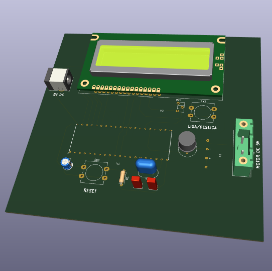

# Desafio Sillion

## Descrição
O objetivo do projeto é controlar um pequeno motor DC de 5V utilizando um microcontronlador. Para realizar a interface com o operador, deve ser utilizado um display LCD 16x2.  

Nessa atividade um push button ligado ao microcontrolador ativa o motor por 10 segundos a cada acionamento. O display informa ao operador sobre o estado do motor com as mensagens ***Motor Ligado*** e ***Motor Desligado***. O microcontrolador utilizado no projeto foi o AT89C51. 

O circuito e o layout da placa foram criados usando o software KiCAD. 

## Organização dos arquivos

No primeiro nível do diretório encontram-se:

* Esquemático do circuito: ***Circuito_Controle_Motor.pdf***
* O código em C para o microcontrolador AT89C51: ***MotorDC_controle.c***
* Um screenshot do layout da placa: ***Placa_Layout.pdf***
* Um modelo 3D aproximado do circuito pronto. (Alguns componentes não possuem modelo 3D, por isso não estão presentes na imagem): ***Controle_Motor_DC_3D.png***

* O folder Datasheets, onde encontram-se os datasheets dos principais componentes do circuito.

* O folder Controle_Motor_DC, onde encontram-se os arquivos gerber e os arquivos gerados pelo Kicad.

Os arquivos gerber para produção da placa estão no caminho ***Controle_Motor_DC/Controle_Motor_DC/Gerber_Files***

